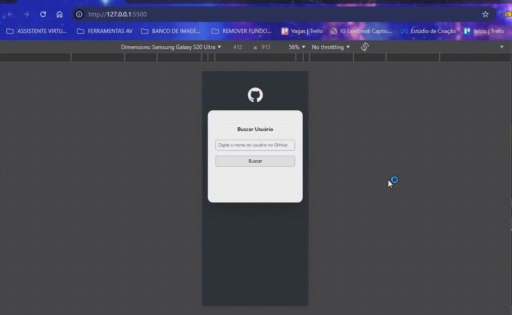

# Projeto Inicial Fetch Github API

Um projeto inicial de Fetch GitHub API onde o usuário pode procurar por programadores cadastrados no GitHub para poder ver seus projetos. Contém o título "Buscar Usuário" e logo embaixo possue uma caixa "Digite o nome do usuário no GitHub" e o botão Buscar. No caso de usuário inexistente, aparecerá a mensagem "Usuário não encontrado". Já para usuário existente, assim que clicar no botão Buscar, aparecerá a foto, nome e frase colocada pelo programador que consta no GitHub. Logo abaixo será listado os botões clicáveis dos 10 mais recentes repositórios que direcionam para o GitHub. No caso do usuário esquecer de digitar no campo "Digite o nome do usuário no GitHub" e clicar no botão Buscar, aparecerá a frase "Preencha o campo com o nome do usuário do GitHub". Para telas de desktops, tablets e celulares 📲💻

## Tecnologias utilizadas
- HTML
- CSS
- JAVASCRIPT

## 📂 Acesso ao projeto

Você pode acessar o código fonte do projeto 

<https://github.com/denisero19/fetch-github-api>