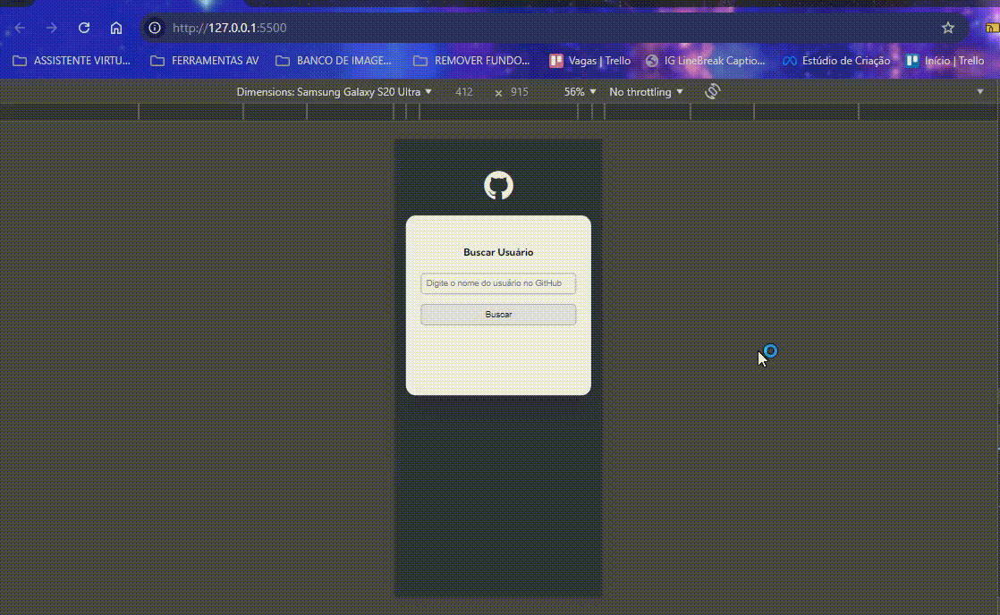

# Projeto Fetch Github API

Projeto para aprimorar o conhecimento aprendido de busca de API do GitHub.

Objetivos - mostrar: 
⁎ Imagem do usuário
⁎ Nome completo do usuário
⁎ Login do usuário
⁎ Bio do usuário
⁎ Número de seguidores do usuário
⁎ Número de pessoas que o usuário está seguindo
⁎ A tela com uma lista de até 10 últimos eventos do usuário com os tipos CreateEvent e PushEvent
⁎ A atividade do tipo CreateEvent com a mensagem "Sem mensagem de commit"
⁎ Nome do repositório
⁎ Link do repositório
⁎ Quantidade de forks do repositório
⁎ Quantidade de estrelas do repositório
⁎ Quantidade de watchers do repositório
⁎ A linguagem de programação do repositório

Foram criados mecanismos de busca com botão Buscar para:
1) Usuários inexistentes trazer a mensagem de "Usuário não encontrado!";

2) Para quando do esquecimento de digitar o usuário trazer a mensagem "Preencha o campo com o nome do usuário do GitHub";

3) Para os usuários existentes   aparecer as informações do usuário como sua bio, seus repositórios que ao clicar neles leva para a página do GitHub e os eventos.

Para telas de desktops, tablets e celulares 📲💻

## Tecnologias utilizadas
- HTML
- CSS
- JAVASCRIPT
- API

## 📂 Acesso ao projeto

Você pode acessar o código fonte do projeto 

<https://github.com/denisero19/fetch-github-api>